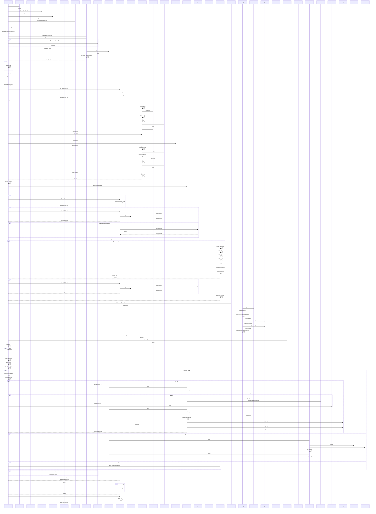
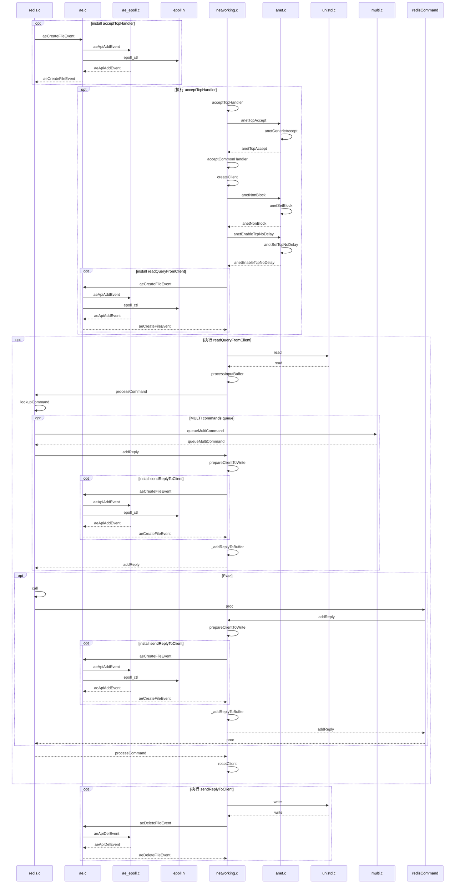

# main 启动流程

# 命令处理流程

# 命令处理流程详情
1. redis-server 启动
    * **main 函数**中创建 socket 监听 （redis.c#listenToPort -> ipfd
    * **main 函数**中添加 accept 事件 (ae.c#aeCreateFileEvent -> acceptTcpHandler, ipfd
    * **main 函数**中循环处理事件, 等待 socket 连接 （ae.c#aeMain
2. redis-server 接收命令
    * 客户端 socket 连接到 redis-server
    * **acceptTcpHandler 函数**中接收, 并创建客户端实体
    * 添加 read 事件 (ae.c#aeCreateFileEvent -> readQueryFromClient, redisClient.fd
    * 客户端 socket 传送命令到 redis-server
    * **readQueryFromClient 函数**中读命令(redisClient.querybuf), 解析命令, 执行命令, 写结果(redisClient.buf)
    * 添加 write 事件 (ae.c#aeCreateFileEvent -> sendReplyToClient, redisClient.fd
3. redis-server 返回结果
    * **sendReplyToClient 函数**将命令执行结果发送给客户端
    * 移除 write 事件 (ae.c#aeDeleteFileEvent -> redisClient.fd